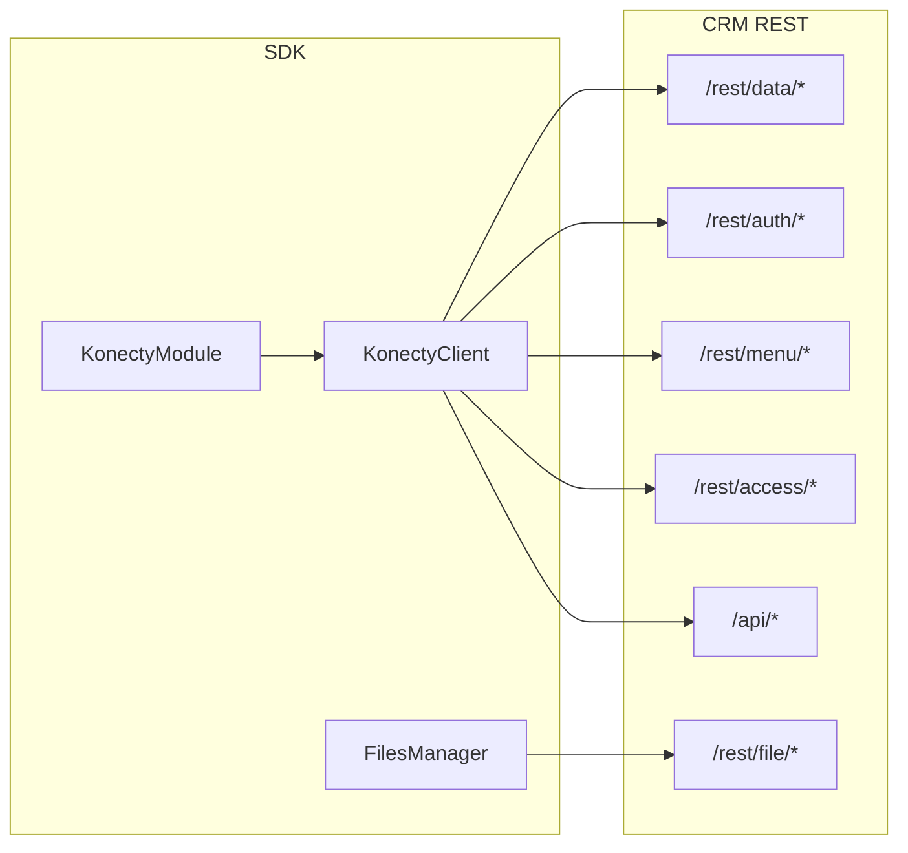

# Referência da API do SDK e mapeamento para o CRM

Este documento descreve a API pública do Konecty SDK e o mapeamento de cada método para os endpoints REST do CRM Konecty. A implementação está em `src/sdk/Client.ts`, `src/sdk/Module.ts` e `src/sdk/FilesManager.ts`.

## Visão do fluxo



## Exportações principais

O pacote exporta: **KonectyClient** e opções/tipos de retorno (KonectyClientOptions, KonectyFindParams, KonectyFindResult, KonectyGetMetaResult, KonectyLoginResult, KonectyUserInfo, KonectyNextOnQueueResult, History); **KonectyModule** e tipos de módulo (ModuleConfig, KonectyDocument, Operator, Condition, filtros, ModuleActionResult, etc.); **FilesManager**; **User**, **Role**, **Group** (tipos e classes de módulo UserModule, RoleModule, GroupModule); **FieldOperators**; **CrossModuleQueryBuilder**, **CrossModuleRelationBuilder**, **createCrossModuleQuery**, **createCrossModuleRelation**; tipos em `types` e subpaths `types/metadata`, `types/access`, `types/filter`, `types/files`, `types/konectyReturn`, `types/crossModuleQuery` (CrossModuleQuery, CrossModuleRelation, CrossModuleAggregator, AggregatorName, etc.); **TypeUtils**.

## KonectyClient — mapeamento para o CRM

Cada método do KonectyClient utiliza o endpoint do CRM indicado. A base URL é a configurada em `endpoint` nas opções do cliente. O header `Authorization` é enviado com o valor de `accessKey` (token).

| Método do SDK | Método HTTP | Path no CRM |
|---------------|-------------|-------------|
| find | GET | /rest/data/:document/find |
| create | POST | /rest/data/:document |
| update | PUT | /rest/data/:document |
| delete | DELETE | /rest/data/:document |
| getHistory | GET | /rest/data/:document/:dataId/history |
| login | POST | /rest/auth/login |
| logout | GET | /rest/auth/logout |
| info | GET | /rest/auth/info |
| getMenu | GET | /api/menu/:menu (main, user ou admin) |
| getListView | GET | /api/list-view/:document/:id |
| getDocumentNew | GET | /api/document/:name |
| getForm | GET | /api/form/:document/:id |
| getMetasByDocument | GET | /api/metas/:document |
| lookup | GET | /rest/data/:document/lookup/:field |
| getDocuments | GET | /rest/menu/documents |
| getDocument | GET | /rest/menu/documents/:name |
| getNextOnQueue | GET | /rest/data/Queue/queue/next/:queueId |
| getAddressByZipCode | GET | /rest/dne/cep/:cep |
| getAccesses | GET | /rest/access/:document |
| getAccess | — | Derivado de getAccesses (filtra por nome do acesso). |
| updateAccess | PUT | /rest/access/:document/:accessName |
| findStream | GET | /rest/stream/:document/findStream |
| streamCount | GET | /rest/stream/:document/count |
| downloadFile | GET | /rest/file/:document/:code/:fieldName/:fileName |
| downloadImage | GET | /rest/image/:document/:recordId/:fieldName/:fileName ou /rest/image/:style/... (style: full, thumb, wm) |
| getKpi | GET | /rest/data/:document/kpi |
| exportList | GET | /rest/data/:document/list/:listName/:type (csv, xlsx, json) |
| getComments | GET | /rest/comment/:document/:dataId |
| createComment | POST | /rest/comment/:document/:dataId |
| updateComment | PUT | /rest/comment/:document/:dataId/:commentId |
| deleteComment | DELETE | /rest/comment/:document/:dataId/:commentId |
| searchCommentUsers | GET | /rest/comment/:document/:dataId/users/search |
| searchComments | GET | /rest/comment/:document/:dataId/search |
| getSubscriptionStatus | GET | /rest/subscriptions/:module/:dataId |
| subscribe | POST | /rest/subscriptions/:module/:dataId |
| unsubscribe | DELETE | /rest/subscriptions/:module/:dataId |
| listNotifications | GET | /rest/notifications |
| getUnreadNotificationCount | GET | /rest/notifications/unread-count |
| markNotificationRead | PUT | /rest/notifications/:id/read |
| markAllNotificationsRead | PUT | /rest/notifications/read-all |
| changeUserAdd, changeUserRemove, changeUserDefine, changeUserReplace, changeUserCountInactive, changeUserRemoveInactive, changeUserSetQueue | POST | /rest/changeUser/:document/:action |
| executeQueryJson | POST | /rest/query/json |
| executeQuerySql | POST | /rest/query/sql |
| listSavedQueries, getSavedQuery, createSavedQuery, updateSavedQuery, deleteSavedQuery, shareSavedQuery | GET/POST/PUT/DELETE/PATCH | /rest/query/saved, /rest/query/saved/:id, .../share |
| getGraph | GET | /rest/data/:document/graph |
| getPivot | GET | /rest/data/:document/pivot |

Parâmetros: find usa query string com filter, sort, limit, start, fields (serializados em JSON). findStream usa os mesmos parâmetros de find mais includeTotal (opcional); a resposta é NDJSON (uma linha JSON por registro); quando includeTotal é true, o total vem no header X-Total-Count. streamCount usa filter e opcionalmente displayName, displayType, sort, withDetailFields; retorna JSON com success e total. create envia o documento no body em JSON. update envia body com ids e data. delete envia body com ids. lookup usa query com search e opções de filtro/paginação. login envia user, password (hash MD5 e SHA256), geolocation e outros campos em application/x-www-form-urlencoded.

## KonectyModule

A classe base KonectyModule (e as subclasses UserModule, RoleModule, GroupModule) delega ao KonectyClient. Os métodos e o endpoint correspondente:

- **findOne**: find com limit 1 → GET /rest/data/:document/find.
- **find**: find com opções → GET /rest/data/:document/find.
- **getHistory**: getHistory do client → GET /rest/data/:document/:dataId/history.
- **validate**: apenas local (validação de campos obrigatórios), não chama o CRM.
- **create**: create do client → POST /rest/data/:document.
- **update**: update do client → PUT /rest/data/:document.
- **delete**: delete do client → DELETE /rest/data/:document.
- **lookup**: lookup do client → GET /rest/data/:document/lookup/:field.
- **filesManager**: retorna uma instância de FilesManager configurada para o módulo; não faz chamada direta.

O nome do documento usado nas rotas é o `name` do ModuleConfig (ex.: User, Role, Group).

## Stream (findStream e streamCount)

**findStream(module, options, includeTotal?)** — Retorna uma Promise que resolve em um objeto com **stream** (async generator de registros) e opcionalmente **total** (quando includeTotal é true, lido do header X-Total-Count). A resposta do CRM é NDJSON; cada linha é um registro. Reduz uso de memória em buscas grandes. O consumidor deve iterar com for await (const record of result.stream). Em caso de erro HTTP 4xx/5xx o método rejeita a Promise.

**streamCount(module, params)** — Retorna a contagem de registros que atendem ao filtro, sem trazer dados. Parâmetros: filter (obrigatório) e opcionalmente displayName, displayType, sort, withDetailFields. Retorno: { success: boolean, total: number }. Útil para paginação ou indicadores.

Caveats: não reutilizar o generator após consumo; em respostas muito longas o stream pode sofrer timeout no servidor.

## Download de arquivo e imagem

**downloadFile(document, recordCode, fieldName, fileName)** — GET /rest/file/:document/:code/:fieldName/:fileName. Retorna Promise\<ArrayBuffer\> com o conteúdo do arquivo. Em 4xx/5xx rejeita a Promise.

**downloadImage(document, recordId, fieldName, fileName, style?)** — Para imagem completa: GET /rest/image/:document/:recordId/:fieldName/:fileName. Com style (thumb ou wm): GET /rest/image/:style/... . style opcional: 'full' | 'thumb' | 'wm'. Retorna Promise\<ArrayBuffer\>. O consumidor pode gravar em arquivo ou converter para Blob/Data URL conforme o ambiente.

## KPI

**getKpi(module, kpiConfig, params?)** — GET /rest/data/:document/kpi. kpiConfig: { operation: 'count' | 'sum' | 'avg' | 'min' | 'max' | 'countDistinct', field?: string }. field é obrigatório para operações que não sejam count. params opcional: filter, sort, limit, start, fields, displayName, displayType, withDetailFields (mesmo padrão do find). Retorno: Promise\<{ success: true, value: number, count: number }\>. Em 4xx/5xx rejeita; 304 (Not Modified) rejeita com mensagem indicando uso de cache (ETag) pelo consumidor.

**exportList(module, listName, format, options?)** — GET /rest/data/:document/list/:listName/:type. format: 'csv' | 'xlsx' | 'json'. options: filter, sort, limit, start, fields, displayName, displayType, withDetailFields (opcional). Retorna Promise\<ArrayBuffer\> com o conteúdo do arquivo. 403 para permissão negada; 400 para tipo inválido.

## Query JSON (CrossModuleQuery) e builder tipado

**executeQueryJson(body)** — POST /rest/query/json. O body deve ser um **CrossModuleQuery** (documento primário, filter, fields, sort, limit, start, relations, groupBy, aggregators, includeTotal, includeMeta), alinhado ao schema do CRM Konecty.

Para construir a query de forma tipada e com IntelliSense, use o **CrossModuleQueryBuilder** e o **CrossModuleRelationBuilder**:

- **Tipos** (em `@konecty/sdk/types/crossModuleQuery` ou exportados pelo pacote): `CrossModuleQuery`, `CrossModuleRelation`, `CrossModuleAggregator`, `CrossModuleSortItem`, `CrossModuleJoinOn`, `AggregatorName`. Constantes: `MAX_RELATIONS`, `MAX_RELATION_LIMIT`, `DEFAULT_PRIMARY_LIMIT`, `DEFAULT_RELATION_LIMIT`.
- **CrossModuleQueryBuilder**: `createCrossModuleQuery(document?)` ou `new CrossModuleQueryBuilder(document?)`. Métodos fluentes: `document(name)`, `filter(f)`, `fields(s)`, `sort(s)`, `limit(n)`, `start(n)`, `groupBy(fields)`, `aggregator(alias, agg)`, `includeTotal(bool)`, `includeMeta(bool)`, `relation(rel)` ou `relation(document, lookup, configure?)`. `build()` retorna `CrossModuleQuery`.
- **CrossModuleRelationBuilder**: `createCrossModuleRelation(document, lookup)`. Métodos: `on(left, right)`, `filter(f)`, `fields(s)`, `sort(s)`, `limit(n)`, `start(n)`, `aggregator(alias, agg)` (obrigatório ao menos um), `relation(rel)` para aninhar relação já construída, `addNested(document, lookup, configure?)` para aninhar via callback. `build()` retorna `CrossModuleRelation`.

Aggregators: `aggregator` deve ser um de `'count' | 'countDistinct' | 'sum' | 'avg' | 'min' | 'max' | 'first' | 'last' | 'push' | 'addToSet'`; para sum/avg/min/max/countDistinct o campo pode ser indicado em `field`. Cada relação deve ter pelo menos um agregador. Limites: até `MAX_RELATIONS` (10) relações por nível; limit entre 1 e `MAX_RELATION_LIMIT`.

Exemplo com builder:

```ts
import { createCrossModuleQuery, KonectyClient } from '@konecty/sdk';

const query = createCrossModuleQuery('Contact')
  .filter({ match: 'and', conditions: [{ term: 'status', operator: 'equals', value: 'active' }] })
  .fields('name.full,code')
  .relation('Opportunity', 'contact', b => b.aggregator('count', { aggregator: 'count' }))
  .includeTotal(true)
  .build();

const client = new KonectyClient({ endpoint: '...', accessKey: '...' });
const { stream, total } = await client.executeQueryJson(query);
for await (const record of stream) { console.log(record); }
```

## FilesManager

A classe FilesManager realiza upload e exclusão de arquivos. O reordenamento (reorder) é feito em memória no SDK; para persistir a nova ordem é necessário enviar os dados do registro ao CRM (update). Detalhes de uso em [FilesManager.md](FilesManager.md).

Mapeamento para o CRM:

| Ação | Método HTTP | Path no CRM (usado pelo SDK) |
|------|-------------|------------------------------|
| upload | POST | /rest/file/upload/ns/access/:document/:recordId ou :recordCode/:fieldName |
| delete | DELETE | /rest/file/delete/ns/access/:document/:recordId ou :recordCode/:fieldName/:fileName |

O SDK usa os literais `ns` e `access` como namespace e accessId. O CRM aceita outras variantes de path (com namespace e accessId explícitos ou omitidos); o SDK utiliza esta forma fixa. A base URL do FilesManager é `fileManager.providerUrl` das opções do cliente ou, se ausente, o `endpoint` do cliente.

## Endpoints do CRM não cobertos pelo SDK

A lista abaixo indica funcionalidades expostas pelo CRM que o SDK atualmente **não** implementa. Não assumir suporte a essas operações ao usar o SDK; para utilizá-las é necessário chamar a API do CRM diretamente ou estender o SDK.

- **Dados**: GET /rest/data/:document/:dataId (obter um registro por id); POST /rest/data/lead/save; POST /rest/data/:document/relations/:fieldName (e preview); GET /rest/data/:document/pivot, graph. Export list e KPI são cobertos por exportList e getKpi.
- **Stream**: GET /rest/stream/:document/find (find em modo stream; o SDK cobre findStream e count).
- **Processo**: POST /rest/process/submit.
- **Query**: POST /rest/query/json (consulta cross-module); POST /rest/query/sql; GET/POST/PUT/DELETE/PATCH /rest/query/saved e share; POST /rest/query/export/:format; GET /rest/query/explorer/modules.
- **Comentários, assinaturas, notificações, changeUser, query (JSON/SQL e saved), graph, pivot**: cobertos pelos métodos correspondentes do KonectyClient (getComments, createComment, …; getSubscriptionStatus, subscribe, unsubscribe; listNotifications, getUnreadNotificationCount, markNotificationRead, markAllNotificationsRead; changeUserAdd, …; executeQueryJson, executeQuerySql, listSavedQueries, …; getGraph, getPivot).
- **Auth**: POST /rest/auth/reset, setgeolocation; GET /rest/auth/setpassword/:userId/:password; POST /rest/auth/setRandomPasswordAndSendByEmail; GET /rest/auth/loginByUrl/:ns/:sessionId.
- **Arquivos**: API /rest/file2 (upload/delete com outro path). Download e image (GET) são cobertos por downloadFile e downloadImage.
- **DNE**: GET /rest/dne/BRA/:state/:city (e variantes com district, place, number, limit).
- **UI/Meta**: POST/DELETE /api/document/:id; GET /api/document/rebuild-references; GET/POST/PUT/DELETE /api/dashboards e rotas de widgets; GET /api/auth/login-options, POST request-otp, verify-otp; GET /api/info/logo; GET /api/translation/:lang.

Referência das rotas do CRM: repositório Konecty em `src/server/routes/rest/` e `src/server/routes/api/`.
